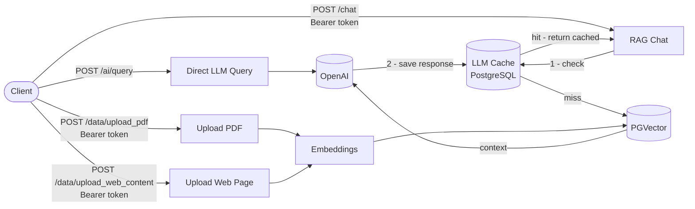

# QueryBooks – Multi-tenant RAG Backend for Intelligent PDF Querying

## Description

QueryBooks is a multi-tenant RAG-based backend designed to transform static documents (PDFs, web content) into an intelligent, searchable knowledge system.
It allows users to upload documents, generate embeddings, and interact with them using natural language queries powered by LLMs.

---

## Tech. Stack

- Python FastAPI
- PostgreSQL + pgvector 
- Docker(optional)

## Prerequisites

- Python 3.12
- PostgreSQL with the `pgvector` extension enabled
- Docker Engine for containerized deployment (optional)
- `.env` configured from `.env.example`
- OpenAI or Ollama credentials if using LLM support

### `.env` setup

1. Copy `.env.example` to `.env`.
2. Set database variables for your environment:
   - `POSTGRESQL_DB_NAME`
   - `POSTGRESQL_PORT`
   - `POSTGRESQL_HOST`
   - `POSTGRESQL_PWD`
3. Choose the LLM provider by setting `LLM_PROVIDER=openai` or `LLM_PROVIDER=ollama`.
4. For OpenAI, configure:
   - `OPENAI_API_KEY`
   - `OPENAI_MODEL`
   - `OPENAI_EMBEDDING_MODEL`
5. For Ollama, configure:
   - `OLLAMA_BASE_URL` (typically `http://localhost:11434` for local Ollama)
   - `OLLAMA_MODEL`
   - `OLLAMA_EMBEDDING_MODEL`

> The backend loads `.env` from the project root via `src/core/constants.py`.

### Database setup

```bash
psql -U postgres

CREATE DATABASE vector_db;
\c vector_db
CREATE EXTENSION IF NOT EXISTS vector;
\q
```

> If `pgvector` is not installed, download the matching installer from [github.com/pgvector/pgvector](https://github.com/pgvector/pgvector/releases) or install via Stack Builder on Windows.

---

## Run without Docker

1. Copy `.env.example` to `.env` and update database and LLM values.
   - Set `LLM_PROVIDER=openai` for OpenAI.
   - Set `LLM_PROVIDER=ollama` for Ollama and ensure `OLLAMA_BASE_URL` points to your local Ollama server.
2. Set up virtual environment and install dependencies:

```bash
uv venv
# On Windows PowerShell: .venv\Scripts\Activate.ps1
# On Unix: source .venv/bin/activate
uv sync
```

3. Apply database migrations:

```bash
alembic upgrade head
```

4. Start the server:

```bash
uvicorn src.api.main:app --host 0.0.0.0 --port 5002 --reload
```

5. Open `http://localhost:5002`

---

## Run with Docker

1. Copy `.env.example` to `.env` and update values.
   - When using Docker Compose, set `POSTGRESQL_HOST=db`.
   - For Ollama inside Docker, keep `OLLAMA_BASE_URL=http://host.docker.internal:11434` unless your Ollama container is reachable by a different host.
2. Start services:

```bash
docker compose up --build
```

3. Access the API at `http://localhost:5002`
4. Stop services with:

```bash
docker compose down
```

---

## Architecture



---

## Project Structure

```
.
├── Dockerfile
├── compose.yaml
├── .env.example
├── requirements.txt
├── README.Docker.md
├── README.md
├── docs/
├── alembic/
├── src/
│   ├── __init__.py                    # package marker
│   ├── api/
│   │   ├── __init__.py                # API package init
│   │   ├── main.py                    # FastAPI app entrypoint
│   │   └── routes/
│   │       ├── __init__.py            # route package init
│   │       ├── ai.py                  # /ai/query route
│   │       ├── chat.py                # /chat route
│   │       ├── data.py                # upload PDF/web data routes
│   │       └── user.py                # auth and user routes
│   ├── core/
│   │   ├── __init__.py                # core package init
│   │   ├── cache.py                   # LLM cache logic
│   │   ├── constants.py               # environment / connection settings
│   │   ├── config.py                  # FastAPI lifespan / startup config
│   │   ├── database.py                # SQLAlchemy engine + session
│   │   ├── jwt.py                     # JWT create/verify helpers
│   │   ├── jwt_utility.py             # auth dependency helpers
│   │   ├── log.py                     # logger setup
│   │   ├── prompts.py                 # prompt templates / system prompts
│   │   └── utility.py                 # shared utility helpers
│   ├── design_patterns/
│   │   └── singleton.py               # singleton metaclass implementation
│   ├── exceptions/
│   │   ├── __init__.py                # exception package init
│   │   ├── base.py                    # app base exception types
│   │   └── database.py                # database exception types
│   ├── factory/
│   │   ├── __init__.py                # factory package init
│   │   ├── agent_factory.py           # create LLM agent instances
│   │   ├── ai_service_factory.py      # instantiate AI services
│   │   ├── embedding_factory.py       # create embedding clients
│   │   └── vector_factory.py          # create vector store clients
│   ├── interface/
│   │   ├── __init__.py                # interface package init
│   │   ├── ai_service.py              # AI service interface
│   │   ├── cache_repo.py              # cache repository interface
│   │   ├── cache_service.py           # cache service interface
│   │   ├── data_repo.py               # data repository interface
│   │   ├── data_service.py            # data service interface
│   │   ├── user_repo.py               # user repository interface
│   │   └── user_service.py            # user service interface
│   ├── models/
│   │   ├── __init__.py                # models package init
│   │   ├── base.py                    # SQLAlchemy base class
│   │   ├── cache.py                   # cache ORM model
│   │   └── user.py                    # user ORM model
│   ├── repository/
│   │   ├── cache_repo.py              # cache DB CRUD operations
│   │   ├── data_repo.py               # embedding/data DB operations
│   │   ├── user_repo.py               # user DB operations
│   │   └── utility.py                 # repository helper utilities
│   ├── schema/
│   │   ├── __init__.py                # schema package init
│   │   ├── ai.py                      # request schemas for AI endpoints
│   │   ├── response.py                # API response schemas
│   │   ├── token.py                   # JWT token payload schema
│   │   └── user.py                    # auth request/response schemas
│   └── services/
│       ├── ai_utility.py              # RAG orchestration and LLM logic
│       ├── base_ai_service.py         # base AI service class
│       ├── cache_service.py           # cache service implementation
│       ├── data_service.py            # document ingestion service
│       ├── data_utility.py            # PDF / web content utilities
│       ├── local_ai_service.py        # local Ollama LLM support
│       ├── openai_service.py          # OpenAI integration
│       └── user_service.py            # user business logic
└── tests/
    ├── __init__.py
    ├── conftest.py                    # pytest fixtures and setup
    ├── api/
    │   ├── __init__.py
    │   ├── test_ai_routes.py           # AI endpoint tests
    │   ├── test_chat_routes.py         # chat endpoint tests
    │   ├── test_data_routes.py         # data endpoint tests
    │   └── test_user_routes.py         # auth endpoint tests
    └── core/
        ├── __init__.py
        ├── test_caching.py            # cache logic tests
        ├── test_database_utility.py    # DB utility tests
        ├── test_jwt.py                # JWT tests
        └── test_utility.py            # helper utility tests
```

---

For architecture diagrams, endpoint details, and database schema, see [docs/api-reference.md](docs/api-reference.md).
