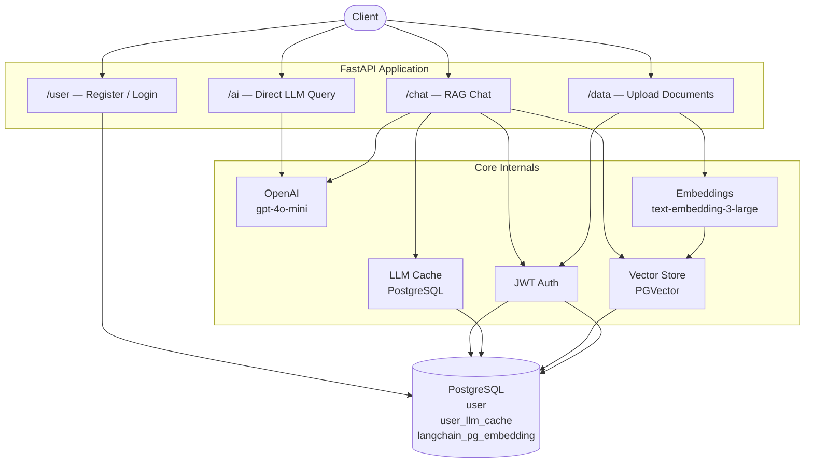
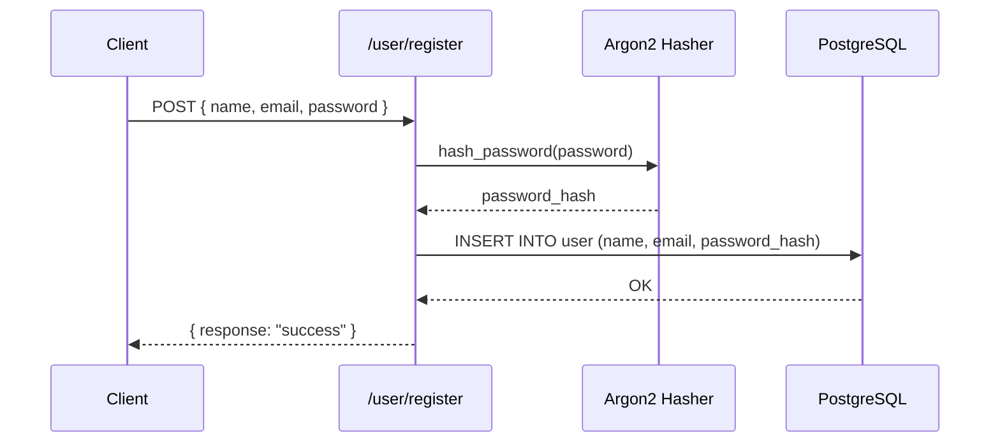
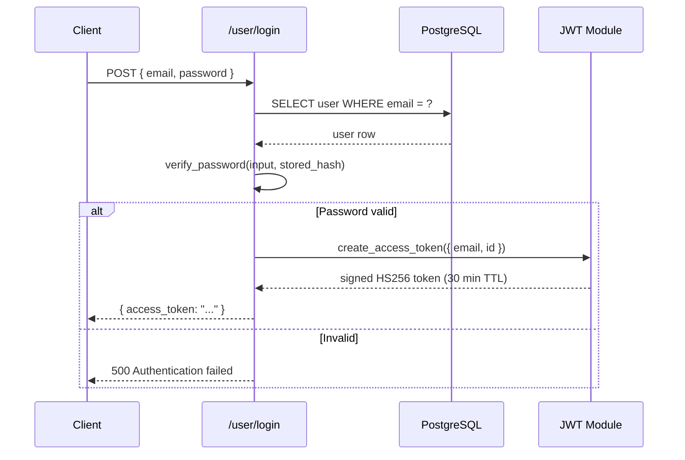
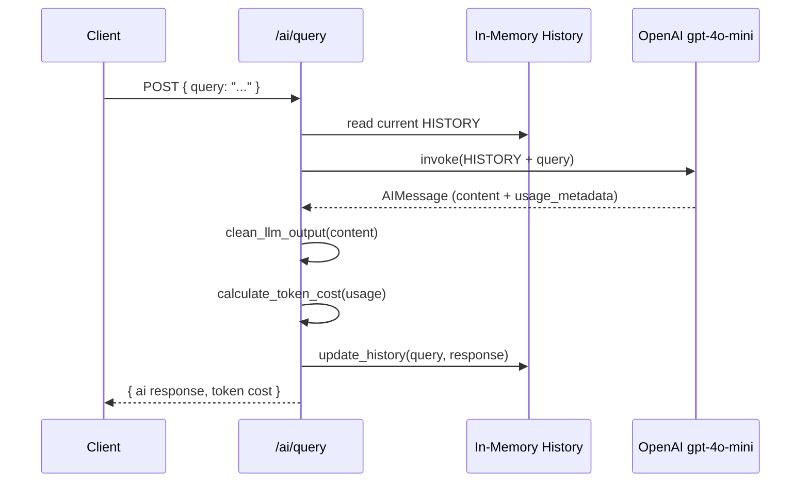
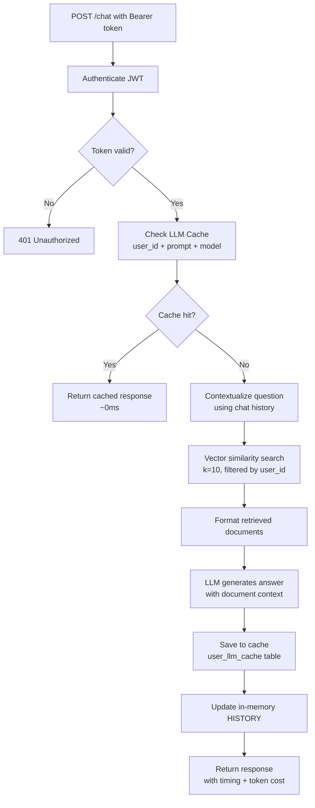
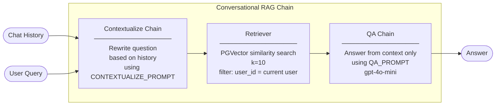
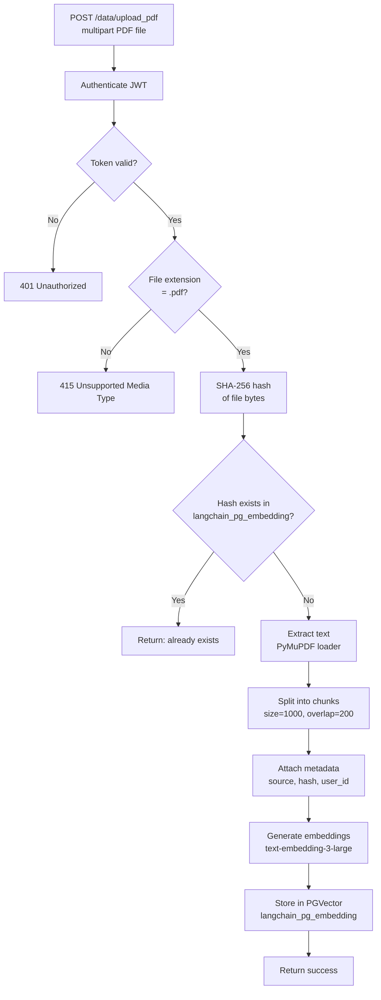
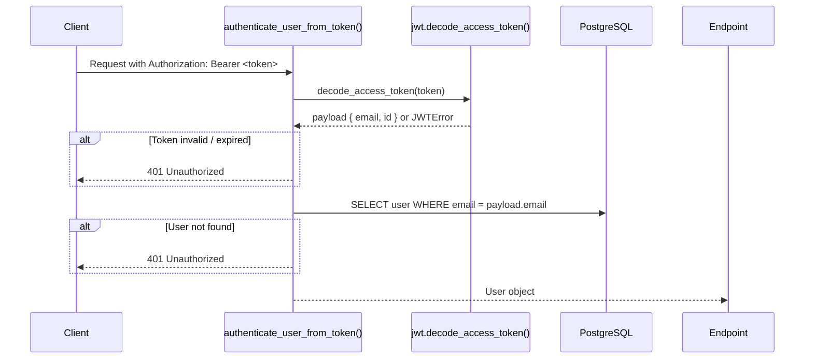
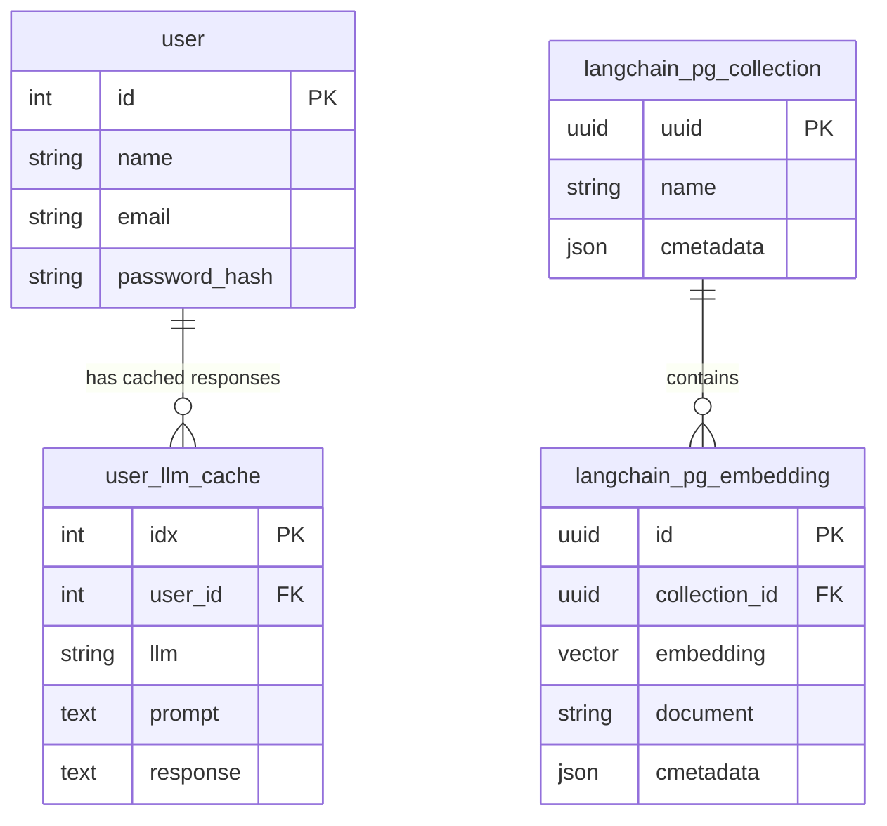

# API Reference

## Local Setup

### 1. Install pgvector

`pgvector` is a PostgreSQL extension that adds vector similarity search — required for storing and querying embeddings.

**Windows (using installer):**

Download the pre-built `.exe` for your PostgreSQL version from [github.com/pgvector/pgvector/releases](https://github.com/pgvector/pgvector/releases) and run it, **or** open **Stack Builder** (bundled with PostgreSQL) → Select your server → *Database Server Extensions* → tick `pgvector`.

**macOS (Homebrew):**

```bash
brew install pgvector
```

**Linux (apt):**

```bash
sudo apt install postgresql-16-pgvector  # replace 16 with your pg version
```

---

### 2. Create the `vector_db` database

The app connects to a database named `vector_db`. Run these commands in `psql` as a superuser:

```sql
-- Connect as superuser
psql -U postgres

-- Create the database
CREATE DATABASE vector_db;

-- Switch into it
\c vector_db

-- Enable the pgvector extension
CREATE EXTENSION IF NOT EXISTS vector;

-- Confirm it loaded
\dx
-- Should show: vector | ... | functions for vector statistics

-- Exit
\q
```

---

### 3. Configure credentials

Create `locals.json` in the project root:

```json
{
  "MainFunction": {
    "OPENAI_API_KEY": "sk-...",
    "POSTGRESQL_PWD": "your_postgres_password",
    "JWT_SECRET_KEY": "your_jwt_secret"
  }
}
```

The app connects as the `postgres` user on `localhost:5432`. If you use a different role or host, update `src/core/secrets/vector_db.py` and `src/core/constants.py` accordingly.

---

### 4. Run Alembic migrations

Migrations create the `user` and `user_llm_cache` tables. The `langchain_pg_embedding` and `langchain_pg_collection` tables are created automatically by `langchain-postgres` on first use.

```bash
alembic upgrade head
```

---

### 5. Start the server

```bash
uvicorn src.api.main:app --reload
```

---

## Architecture Overview



---

## Endpoints

### POST `/user/register`

Creates a new user. The password is hashed with Argon2 before being stored — the raw password never touches the database.



**Internals used:**
- `utility.hash_password()` — Argon2 hashing
- `User` ORM model — maps to the `user` table
- SQLAlchemy session via `Depends(get_db)`

---

### POST `/user/login`

Authenticates a user and returns a short-lived JWT.



**Token payload:**
```json
{ "email": "user@example.com", "id": 1, "exp": 1234567890 }
```

**Internals used:**
- `utility.verify_password()` — Argon2 comparison
- `jwt.create_access_token()` — signs with HS256
- Secret key loaded from `locals.json` (dev) or AWS Secrets Manager (prod)

---

### POST `/ai/query`

A direct, unauthenticated LLM call. No documents, no retrieval — just a raw conversation with the model. Keeps an in-memory session history.



**Internals used:**
- `ai_utility.get_agent()` — initializes `ChatOpenAI(temperature=0)`
- `ai_utility.clean_llm_output()` — strips markdown artifacts
- `ai_utility.calculate_token_cost()` — computes cost from `usage_metadata`
- `ai_utility.update_history()` — appends `HumanMessage` + `AIMessage` to global `HISTORY`

---

### POST `/chat`  *(requires auth)*

The core RAG endpoint. Uses the user's uploaded documents as context. Results are cached per-user to avoid redundant LLM calls.



#### RAG Chain Internals



**Cache key:** `(user_id, prompt_text, llm_model_name)`
**Retrieval filter:** embeddings are tagged with `user_id` at upload time, so users only retrieve their own documents.

**Internals used:**
- `jwt_utility.authenticate_user_from_token()` — FastAPI dependency, validates Bearer token
- `cache.get_cached_response()` — queries `user_llm_cache` table
- `ai_utility.get_conversational_rag_chain()` — builds the full LangChain pipeline
- `ai_utility.contextualized_retrival()` — rewrites question if history exists
- `secrets.vector_db` — singleton `PGVector` store instance
- `cache.save_to_cache()` — upserts result into `user_llm_cache`

---

### POST `/data/upload_pdf`  *(requires auth)*

Processes a PDF file into vector embeddings. Duplicate detection prevents re-embedding the same file.



**Internals used:**
- `database_utility.check_existing_hash()` — raw SQL query on `langchain_pg_embedding.cmetadata`
- `database_utility.get_documents_from_file_content()` — reads bytes with `PyMuPDFLoader`
- `RecursiveCharacterTextSplitter(chunk_size=1000, chunk_overlap=200)`
- `database_utility.add_base_url_hash_user_id_to_metadata()` — injects `user_id`, `hash`, `source` into each chunk's metadata
- `PGVector.aadd_documents()` — async embedding + storage

---

### POST `/data/upload_web_content`  *(requires auth)*

Fetches a URL, extracts visible text, and stores it as embeddings — same pipeline as PDF.

```mermaid
flowchart TD
    A[POST /data/upload_web_content<br/>{ url }] --> B[Authenticate JWT]
    B --> C{Token valid?}
    C -- No --> Z[401 Unauthorized]
    C -- Yes --> D[SHA-256 hash of URL string]
    D --> E{Hash exists in<br/>langchain_pg_embedding?}
    E -- Yes --> X[Return: already exists]
    E -- No --> F[Fetch page content<br/>WebBaseLoader / BeautifulSoup]
    F --> G[Extract base URL<br/>remove fragments]
    G --> H[Split into chunks<br/>size=1000, overlap=200]
    H --> I[Attach metadata<br/>source URL, hash, user_id]
    I --> J[Generate embeddings<br/>text-embedding-3-large]
    J --> K[Store in PGVector]
    K --> L[Return success]
```

**Internals used:**
- `utility.hash_str()` — SHA-256 of URL string for deduplication
- `WebBaseLoader` (LangChain) — HTTP fetch + BeautifulSoup parsing
- Same chunking, metadata, and PGVector storage path as PDF upload

---

## Authentication Flow

Shared by `/chat` and `/data/*` endpoints.



---

## Database Schema



> `langchain_pg_embedding.cmetadata` stores `{ user_id, source, hash }` — this is what filters retrieval per user and enables deduplication.
